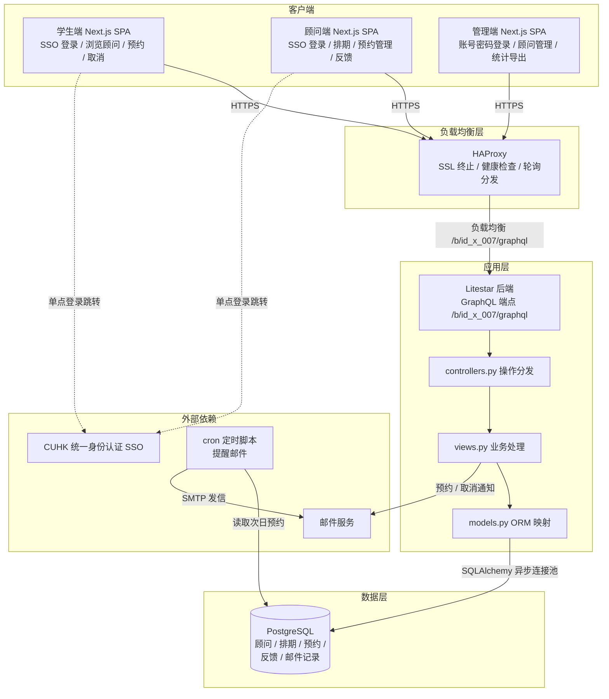
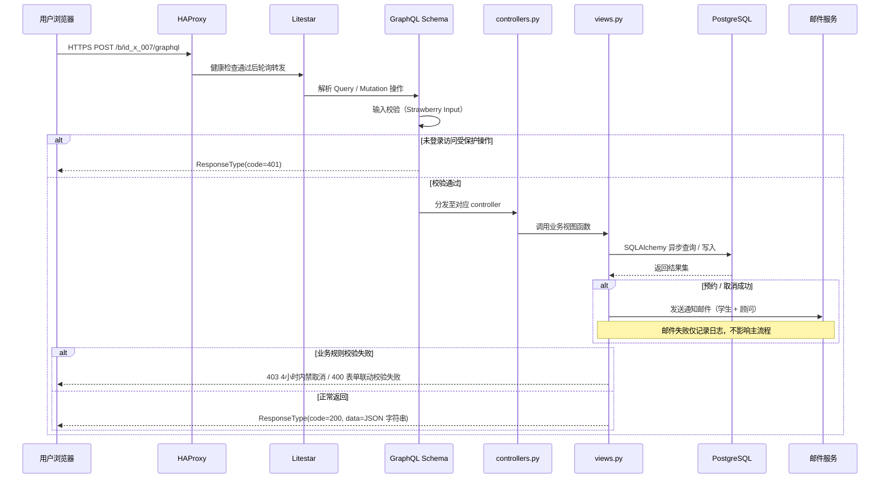

<div align="center">

# id_x_007: SME UGO 朋辈顾问系统

**顾问展示 → 时段排期 → 预约报名 → 邮件通知 → 取消与反馈 → 数据导出 的全流程咨询闭环**


</div>

---

## 1. 简介 (Introduction)

- **Slogan**: 为经管学院朋辈顾问咨询项目提供线上化的一对一咨询预约能力。
- **Description**: 本系统覆盖**顾问信息展示 → 时段排期 → 预约报名 → 邮件通知 → 取消与反馈 → 数据汇总导出**的全流程闭环。学生侧将"找朋辈顾问咨询"从邮件 / 微信沟通升级为自助式在线预约，降低协调成本；管理侧将人工登记表升级为结构化数据，支持批量排期与一键导入 / 导出，提升运营效率；顾问侧可通过系统自主排期，并实时查看个人预约情况。系统采用前后端分离架构：后端基于 **Litestar** 异步框架，对外仅暴露单一 **GraphQL** 端点；前端基于 **React + Next.js + Tailwind CSS**，提供学生端、顾问端与管理端三套布局。

## 2. 核心特性 (Features)

- 三端分离：学生端与顾问端（CUHK 统一身份认证 SSO 登录，首次登录自动建档）与管理端（账号密码登录）共用同一站点、三套布局。
- 顾问展示：顾问卡片展示照片、姓名、年级、专业、擅长方向与简介，支持按专业 / 擅长方向筛选，卡片联动近期可预约时段。
- 预约报名：四步流程（选顾问 → 选时段 → 填咨询信息 → 提交确认），线上 / 线下两种咨询形式表单联动校验。
- 排期管理：批量 Excel 模板上传与单个时段增删改并行，支持时段暂停 / 恢复与"暂不接待"隐藏。
- 数据闭环：咨询完成后顾问填写反馈总结（仅管理员与顾问可见），管理端提供统计分析与 Excel 导出。

## 3. 项目亮点 (Highlights)

1. **全流程业务闭环** —— 从顾问展示、排期、预约、提醒、取消到反馈总结与数据导出，一个系统覆盖朋辈咨询业务全部环节。
2. **单端点 GraphQL 契约** —— 全部业务经 `POST /b/id_x_007/graphql` 统一收发，Query / Mutation 强类型 Schema 描述，前后端以 `ResponseType(code, message, data)` 统一响应封装。
3. **三角色权限矩阵** —— 学生 / 朋辈顾问 / 管理员三类角色能力边界清晰：SSO 与账号密码双认证通道，顾问自助排期，管理员全量管控。
4. **精细表单联动** —— 线上咨询：电话必填 + 微信号必填 + 会议链接选填；线下咨询：电话必填 + 微信号选填 + 会议链接置灰，规则随选项实时切换。
5. **精细业务规则** —— 报名截止于咨询开始前 24 小时，学生与顾问双方均在开始前 4 小时内禁止取消，取消必填原因并双向邮件通知。
6. **定时邮件自动化** —— cron 脚本驱动顾问提醒与学生提醒（每日 21:00 检查次日预约），预约成功、取消通知即时双向触达，管理员可查阅发送记录。
7. **运营数据可度量** —— 管理端统计总预约数、完成数、取消数与各顾问咨询量排名，支持预约明细与反馈汇总双 Excel 导出。

## 4. 技术栈 (Tech Stack)

<p align="center">表 4-1 技术栈一览</p>

| 分类 | 名称 | 版本 | 用途 |
|------|------|------|------|
| 编程语言 | Python / TypeScript | 3.11+ / 5.x | 后端服务 / 前端开发 |
| 后端框架 | Litestar | 2.x | 异步 Web 框架（GraphQL 单端点） |
| API 规范 | GraphQL（Strawberry） | — | Query / Mutation 强类型契约 |
| ORM | SQLAlchemy | 2.x | PostgreSQL 异步数据访问与连接池 |
| 数据处理 | pandas / openpyxl / xlsxwriter | 2.x / 3.x | 批量排期解析与报表导出 |
| 前端框架 | React / Next.js | 19 / 16 | 服务端渲染单页应用与路由 |
| 样式体系 | Tailwind CSS | 4.x | 原子化样式与主题变量 |
| 构建工具 | Next.js（Turbopack） | — | 前端构建与类型检查 |
| 数据库 | PostgreSQL | 12+ | 业务数据存储 |
| 负载均衡 | HAProxy | 2.x | SSL 终止、健康检查、反向代理 |
| 运维组件 | Supervisor / cron | — | 进程守护、定时邮件 |

## 5. 整体架构图 (Overall Architecture Diagram)



## 6. 请求流转图 (Request Flow Diagram)



## 7. 目录结构 (Directory Structure)

```text
id_x_007/                         # 模型根目录
├── src/
│   ├── controllers/              # 控制层：GraphQL 操作分发
│   │   └── x_controllers.py      #   Query / Mutation 方法入口
│   ├── models/                   # ORM 层：SQLAlchemy 模型
│   │   └── x_models.py           #   顾问 / 排期 / 预约 / 反馈 / 邮件记录
│   ├── schemas/                  # 契约层：Strawberry 类型定义
│   │   └── x_schemas.py          #   Input / ResponseType
│   └── views/                    # 视图层：业务逻辑与规则校验
│       └── x_views.py            #   预约 / 取消 / 排期 / 反馈 / 导出
├── scripts/
│   ├── send_reminder_mail_advisor.py   # 顾问提醒（每日 21:00，次日有预约）
│   └── send_reminder_mail_student.py   # 学生提醒（每日 21:00，次日有预约）
├── utils/
│   ├── database_client.py        # 数据库配置加载（加密凭据解密）
│   ├── encrypt_util.py           # 加密工具
│   ├── decrypt_util.py           # 解密工具
│   └── log_util.py               # 日志工具
├── ops/
│   └── haproxy.cfg               # HAProxy 负载均衡配置
├── web/                          # 前端应用（Next.js + React + Tailwind CSS）
│   ├── src/
│   │   ├── api/                  # GraphQL 客户端封装（单端点 POST）
│   │   ├── app/                  # App Router 页面：登录、顾问列表、预约、
│   │   │                         #   我的记录、排期管理、反馈、统计导出、SSO 回调
│   │   ├── components/           # 组件：布局、顾问卡片、预约表单、排期表格
│   │   └── stores/               # 用户状态管理
│   ├── next.config.ts            # Next.js 构建配置
│   └── package.json              # 前端依赖清单
├── x_plugin.py                   # 插件入口：注册 GraphQL 路由 /b/id_x_007/graphql
├── requirements.txt              # Python 依赖清单
├── LICENSE                       # AGPL-3.0 许可证
└── README.md                     # 项目说明文档
```

## 8. API 接口文档 (API Documentation)

- 统一端点：`POST https://<HOST>/b/id_x_007/graphql`
- 所有操作均为 GraphQL Query / Mutation；请求体 `{"query": "...", "variables": {"input": {...}}}`。
- 响应统一封装为 `ResponseType { code, message, data }`，`data` 为 JSON 字符串，需客户端二次解析。
- 受保护操作需登录会话，未登录返回 `code=401`。

<p align="center">表 8-1 GraphQL 操作汇总</p>

| 类型 | 操作名 | 说明 |
|------|--------|------|
| Mutation | login | 管理员账号密码登录 |
| Mutation | logout | 登出 |
| Mutation | user_oauth | SSO 登录回调建档（学生 / 顾问） |
| Query | get_advisor_list | 顾问列表（按专业 / 擅长方向筛选） |
| Query | get_advisor_detail | 顾问详情（含近期可预约时段） |
| Mutation | apply_booking | 提交预约（线上 / 线下表单联动校验，400） |
| Query | get_my_booking_list | 学生端本人预约记录分页查询 |
| Mutation | cancel_booking | 取消预约（开始前 4 小时内禁止，403；双向邮件通知） |
| Mutation | create_schedule | 顾问单个新增时段 |
| Mutation | update_schedule | 顾问修改 / 暂停 / 恢复时段 |
| Mutation | delete_schedule | 顾问删除时段 |
| Mutation | upload_schedule | 批量排期模板上传（.xlsx，400 格式错误） |
| Query | download_schedule_template | 排期模板下载 |
| Query | get_advisor_booking_list | 顾问查看报名自己的预约明细 |
| Mutation | finish_booking | 咨询结束后标记"已完成" |
| Mutation | create_feedback | 填写咨询反馈总结（仅管理员与顾问可见） |
| Query | export_advisor_booking | 顾问导出个人历史预约（Excel） |
| Mutation | create_advisor | 管理员创建顾问账号 |
| Mutation | update_advisor | 管理员编辑顾问信息 / 启停状态 |
| Mutation | delete_advisor | 管理员删除顾问账号 |
| Query | get_booking_list | 管理端全量预约查询（按顾问 / 日期 / 状态筛选） |
| Query | get_feedback_list | 管理端反馈记录汇总查询 |
| Query | get_booking_stats | 统计分析（总数 / 完成 / 取消 / 顾问排名） |
| Query | export_booking | 导出完整预约数据（Excel） |
| Query | export_feedback | 导出反馈评价汇总表（Excel） |
| Query | get_mail_log | 邮件发送记录查询 |

调用示例（需替换 `<BASE_URL>` 与会话 Cookie）：

```bash
curl -X POST "<BASE_URL>/b/id_x_007/graphql" \
  -H "Content-Type: application/json" \
  -d '{
    "query": "mutation Login($input: LoginInput!) { login(input: $input) { code message data } }",
    "variables": {"input": {"username": "<USERNAME>", "password": "<PASSWORD>"}}
  }'

curl -X POST "<BASE_URL>/b/id_x_007/graphql" \
  -H "Content-Type: application/json" \
  -H "Cookie: <SESSION_COOKIE>" \
  -d '{
    "query": "mutation Apply($input: ApplyInput!) { apply_booking(input: $input) { code message data } }",
    "variables": {"input": {"schedule_id": "<ID>", "topic": "<咨询主题>", "content": "<咨询内容>", "mode": "online", "phone": "<联系电话>", "wechat": "<微信号>"}}
  }'
```

## 9. 快速部署 (Quick Deploy)

### 环境准备 (Prerequisites)

- Python 3.11+（建议 conda 虚拟环境）
- Node.js 20+ 与 npm
- PostgreSQL 12+
- HAProxy、Supervisor、cron（生产环境）

### 安装 (Installation)

```bash
# 后端依赖
cd id_x_007
pip install -r requirements.txt

# 前端依赖
cd web
npm install
```

### 运行 (Run)

```bash
# 后端（GraphQL 端点 /b/id_x_007/graphql，数据库凭据经环境变量加密注入）
python x_plugin.py

# 前端开发
cd web
npm run dev

# 前端生产构建
npm run build
```

### 生产部署 (可选)

- **Supervisor**：配置进程守护托管后端进程（含 `DB_HOST` / `DB_PORT` / `DB_USERNAME` / `DB_PASSWORD` 加密环境变量）。
- **HAProxy**：使用 `ops/haproxy.cfg`，SSL 终止于 HAProxy；`/b/id_x_007/graphql` 经健康检查（`option httpchk`）后轮询分发至多个后端实例，示例：

```text
frontend sme_ugo
    bind *:443 ssl crt /etc/haproxy/certs/cuhk-edu-cn.pem
    default_backend litestar_nodes

backend litestar_nodes
    balance roundrobin
    option httpchk GET /b/id_x_007/health
    server node1 127.0.0.1:8101 check
    server node2 127.0.0.1:8102 check
```

- **cron**：配置提醒邮件定时任务：

```text
0 21 * * *  python scripts/send_reminder_mail_advisor.py
0 21 * * *  python scripts/send_reminder_mail_student.py
```
